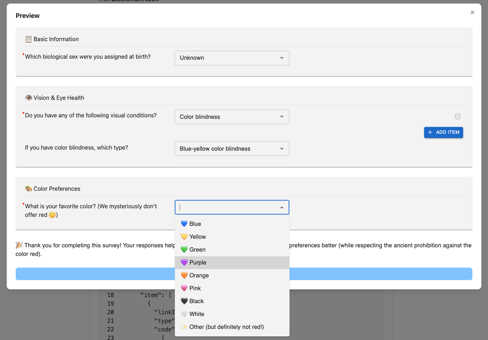
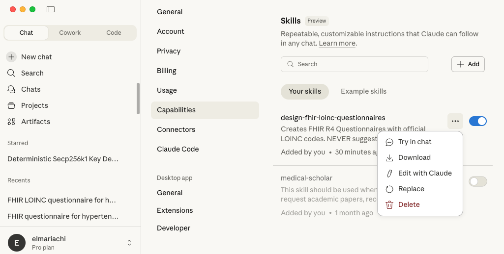

# FHIR Questionnaire Skill

A Claude skill that enables AI agents to create and validate FHIR Questionnaires with proper LOINC/SNOMED coding, discover standardized answer lists, and validate results against questionnaire schemas.

[](https://github.com/welshare/skill-questionnaire-builder/releases/tag/latest)




## What are Skills?

Skills are folders of instructions, scripts, and resources that Claude loads dynamically to improve performance on specialized tasks. Rather than relying on Claude's general knowledge, skills provide domain-specific instructions and tools that make Claude consistently better at particular use cases.

Learn more: [Official Skills Repository](https://github.com/anthropics/skills/blob/main/README.md)

## Network Access

This skill requires whitelisted network access to:
- `clinicaltables.nlm.nih.gov` (LOINC search)
- `tx.fhir.org` (FHIR terminology server)

## Installation

### Quick Install

1. **Download the latest release**: [fhir-questionnaire.skill](https://github.com/welshare/skill-questionnaire-builder/releases/latest/download/fhir-questionnaire.skill)
2. Install it in Claude Desktop or Claude Code



### Manual Download

Visit the [Releases page](https://github.com/welshare/questionnaire-skill/releases) to download a specific version.

## Development & Distribution

### For Developers

To package and distribute this skill:

```bash
# Create a distributable .skill package
make package

# Test the package contents
make test-package

# Clean build artifacts
make clean
```

**Documentation:**
- [SKILL.md](fhir-questionnaire/SKILL.md) - Skills are humanly readable
- [PACKAGING.md](PACKAGING.md) - Detailed packaging procedures
- [RELEASE.md](RELEASE.md) - How to create and publish releases

## Contents

- **SKILL.md** - Core instructions and workflows
- **scripts/** - LOINC search, ValueSet discovery, and validation tools
- **assets/templates/** - FHIR questionnaire templates and examples
- **references/** - Comprehensive FHIR and LOINC documentation
